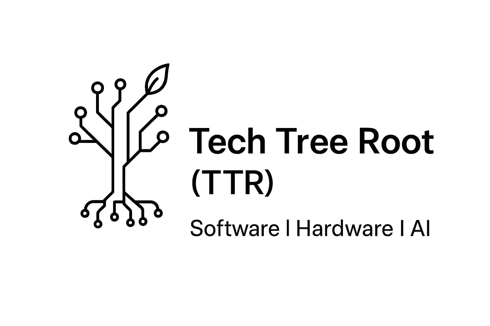

<p align="center">
  
</p>

# 🌱 Tech Tree Root (TTR)

**Tech Tree Root (TTR)** is my personal, feature-driven project where I bring together software, hardware, and AI tools into one structured system. Inspired by the idea of a tech tree, each part of the project builds on the last — with clear goals, feature unlocks, and growing complexity.

This is not just a Unity project — it connects **multiple technologies**, including programming, IoT, AI, embedded systems, and electrical control.

---

## 👤 About Me

- **Name**: Gladwin Mano  
- **Background**: Diploma in **Electrical & Electronics Engineering (EEE)**  
- **Current Studies**: **Electronics & Communication (Advanced Communication Technology)**  
- **Programming Knowledge**: C, C++, Python, JavaScript, Dart  

---

## 🎯 Project Vision

TTR is where I:  
- Build and connect projects across multiple platforms  
- Explore new tools and technologies  
- Develop features with a clear, goal-based path  
- Track how systems evolve and depend on each other  

---

## 🧠 Technologies Used

- **Programming**: C, C++, Python, JavaScript, Dart (Flutter)  
- **AI**: ML models, smart logic integration (planned)  
- **Game Dev**: Unity (C#), real-time visual systems  
- **Embedded Systems**: Arduino, microcontrollers, sensors  
- **IoT & Control**: Device integration, smart hardware control  
- **Dev Tools**: Visual Studio, VS Code, Unity  

---

## 🚧 Current Focus

- Unity foundation setup  
- Basic tech node logic  
- Planning hardware-software interaction  
- Uploading experiments and new features regularly  

---

## 🔍 Example Use Cases

- Game feature trees in Unity  
- AI-enhanced systems  
- IoT devices communicating with game logic  
- Embedded control systems (lights, motors, sensors)  
- Cross-platform experimentation and learning  

---

## 📦 Getting Started

```bash
git clone https://github.com/gx09812/Tech-Tree-Root-TTR-.git
